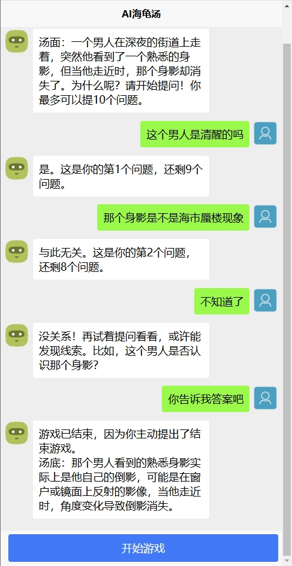

# 海龟汤游戏

**感兴趣的朋友，不妨来个星星✨和关注，你的支持是我持续开源和维护的重要动力！**

## 一、介绍

这是一款AI海龟汤游戏，后端采用SpringBoot + AI火山方舟SDK，前端采用uni-app + vue3进行实现的。

## 二、技术架构

**后端**：

* Java + SpringBoot框架
* Hutool 工具类
* Swagger + Knife4j接口文档组合
* 火山方舟AI SDK接入 

**前端：**

* uni-app + vue3框架
* [uni-ui组件库](https://ext.dcloud.net.cn/plugin?id=55)
* [lime-loading 加载元素](https://ext.dcloud.net.cn/plugin?id=14957)

## 三、业务流程

1. 玩家进入页面
2. 点击【开始游戏】，AI主持人会立刻给出开场（汤面）
3. 接下来用户可以与主持人进行一问一答的对话，来一步步揭开谜面。
4. 用户可以主动结束，或者AI主持人在10个问答后主动结束。

## 四、应用展示截图

## 五、相关文档

[如何通过火山方舟创建AI应用](doc/如何通过火山方舟创建AI应用.md)

